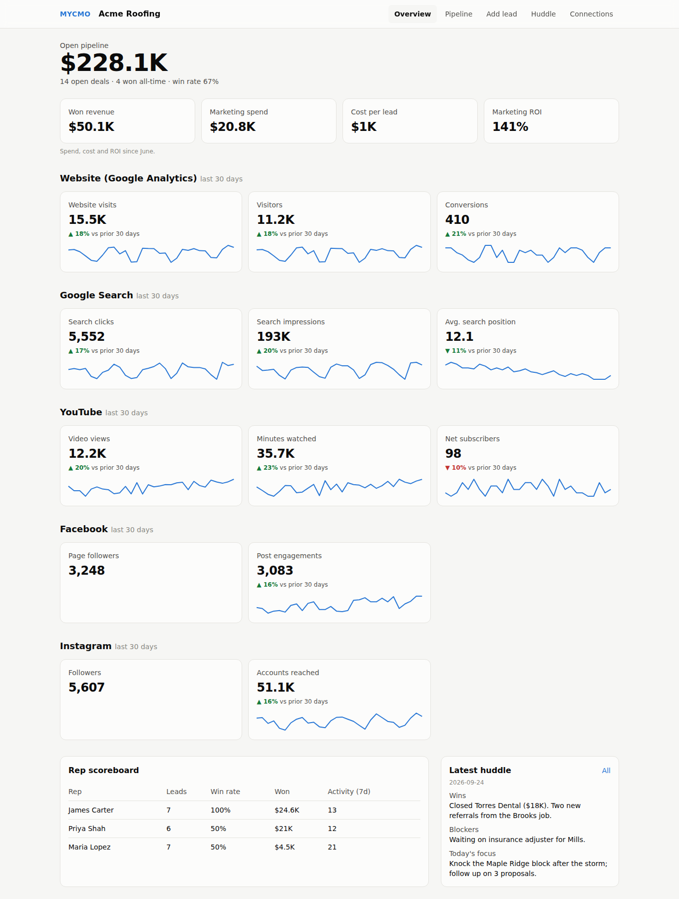

# MYCMO

A client-facing marketing + sales dashboard. Each client business logs in and sees:

- **Marketing:** Google Analytics 4, Google Search Console, YouTube, Facebook Page, Instagram
- **Sales:** open pipeline value, win rate, rep scoreboard, cost per lead, marketing ROI
- **Daily work (for reps, mobile first):** quick-add lead form, tap-to-move / drag-and-drop pipeline, one-tap activity logging, daily huddle log

Stack: SvelteKit 2 + Svelte 5 (runes), Supabase (Postgres, Auth, RLS), Tailwind CSS 4, deployed on Vercel.

## Try it with no setup (demo mode)

```bash
npm install && npm run build
DEMO_MODE=true npx vite preview
```

Open http://localhost:4173/app. The whole app runs on built-in sample data for a fictional
"Acme Roofing" (no Supabase, Google or Meta needed), and new leads and stage moves work until
you restart. Screenshots are in `screenshots/`. Never set `DEMO_MODE` in production.



## How it fits together

```
Client/Rep browser ──> SvelteKit (Vercel) ──> Supabase Postgres (RLS on every table)
                              │
          nightly cron ───────┤  /api/sync
                              ├──> Google APIs (GA4 Data, Search Console, YouTube Analytics)
                              └──> Meta Graph API (Page + Instagram insights)
                                         │
                                         └──> metric_snapshots (one row per source/metric/day)
```

The dashboard **only reads `metric_snapshots`**. It never calls Google or Meta on page load,
so it stays fast and does not burn API quota. A nightly job (and a "Sync now" button) fills the table.

### Who sees what

| Role | Where it comes from | Can do |
|---|---|---|
| Agency staff | `profiles.is_agency_staff = true` | Everything, every client. Creates clients. |
| Owner | `org_members.role = 'owner'` | Everything for their business: connect accounts, spend, all leads |
| Rep | `org_members.role = 'rep'` | Add leads, log activity, move **their own** or unassigned leads |
| Viewer | `org_members.role = 'viewer'` | Read-only |

OAuth tokens are AES-256-GCM encrypted by the app and stored in `integration_secrets`,
a table with RLS on and **no** policies, so only server code using the service role can read it.

## Setup (about an hour, not counting platform approvals)

1. **Supabase:** create a project. In the SQL editor, run `supabase/migrations/0001_init.sql`.
   Under Authentication > URL Configuration, add `{APP_URL}/auth/callback` as a redirect URL.
2. **Env:** `cp .env.example .env` and fill it in. Generate the encryption key with `openssl rand -base64 32`.
3. **Make yourself agency staff:** invite yourself under Authentication > Users, then run
   `update profiles set is_agency_staff = true where email = 'you@yourdomain.com';`
4. **Google Cloud:** create an OAuth client (Web). Enable *Google Analytics Data API*, *Google Analytics Admin API*,
   *Google Search Console API*, *YouTube Data API v3*, *YouTube Analytics API*.
   Redirect URI: `{APP_URL}/api/integrations/google/callback`.
5. **Meta:** create a Business app, add Facebook Login for Business.
   Redirect URI: `{APP_URL}/api/integrations/meta/callback`.
6. `npm install && npm run dev`
7. **Deploy:** push to GitHub, import into Vercel, add the same env vars plus `CRON_SECRET`.
   `vercel.json` schedules `/api/sync` nightly.

### Adding a client

Sign in as agency staff > add client > invite the owner in Supabase Auth > insert their
`org_members` row with role `owner`. The owner then connects Google and Meta from **Connections**.
(A self-serve invite screen is a good next feature.)

## Read this before promising clients a launch date

- **Google verification.** The four read-only scopes (Analytics, Search Console, YouTube, YouTube Analytics)
  are classed as sensitive. In "Testing" mode only up to 100 listed test users can connect and their
  refresh tokens expire after 7 days. Going to production needs Google's OAuth app verification:
  a privacy policy, a homepage on your domain, and a demo video. Plan for this early.
- **Meta App Review.** `pages_read_engagement`, `read_insights`, `instagram_basic` and
  `instagram_manage_insights` need Advanced Access through App Review plus Business Verification before
  anyone who isn't a role-holder on your app can connect.
- **Meta tokens expire.** Meta gives no refresh token. Long-lived user tokens last about 60 days, so
  a client has to click **Reconnect** occasionally. The Connections page shows when that is needed.
- **Meta metric churn.** Meta retires Insights metrics regularly. Each metric is fetched separately so a
  retired one shows as a warning instead of breaking the sync. The metric names live in
  `src/lib/server/connectors/meta.ts` and should be checked against the current Graph API changelog
  before launch; they have not yet been tested against a live Meta app.

## Adding another platform (TikTok, LinkedIn, Google Ads, Google Business Profile, ...)

1. Implement the `Connector` interface in `src/lib/server/connectors/<name>.ts`
2. Register it in `src/lib/server/connectors/index.ts`
3. `alter type integration_provider add value '<name>';`
4. Add its metrics to `METRICS` in `src/lib/metrics.ts`, and a picker on the Connections page

## Development

```bash
npm run check   # svelte-check / TypeScript
npm test        # unit tests (encryption, OAuth state signing, dashboard math)
npm run build
```

### Testing the database

`supabase/tests/rls_test.sql` checks the permission rules (outsiders can't see other clients,
reps can't edit each other's leads, nobody can read tokens, nobody can promote themselves).
Against a scratch Postgres 16 database:

```bash
psql "$SCRATCH_DB" -f supabase/tests/auth_stub.sql -f supabase/migrations/0001_init.sql -f supabase/tests/rls_test.sql
```

Every line should print `PASS`. (The one `ERROR` line is the expected rejection of a self-promotion attempt.)
